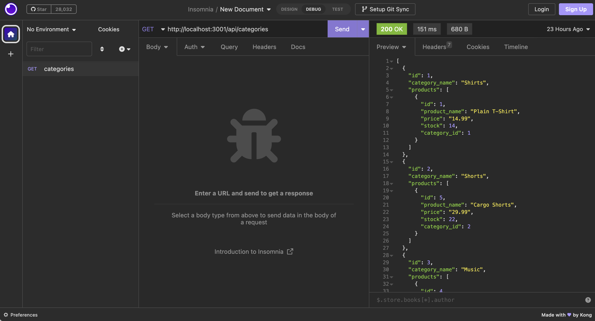
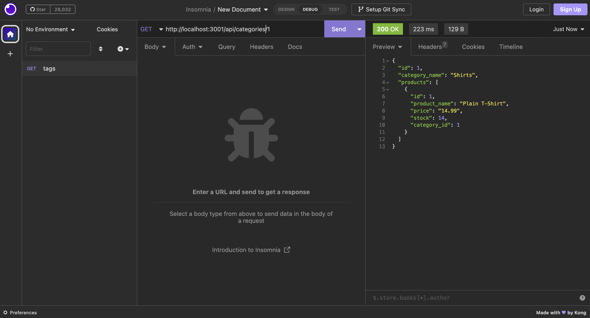
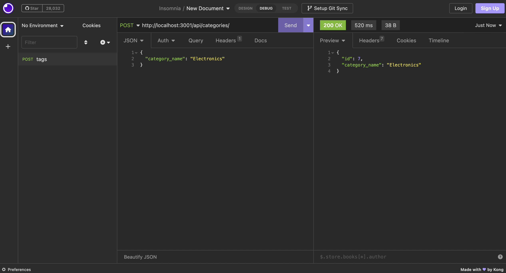
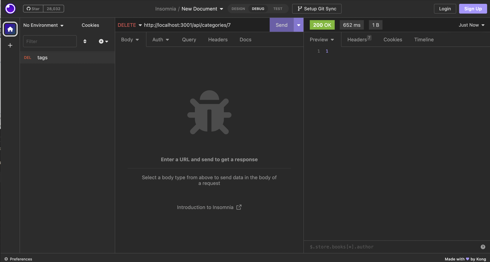
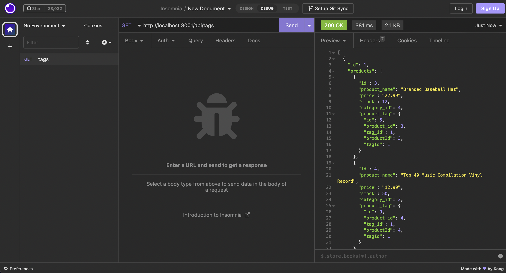

# E-Commerce Back End

## Table of Contents 
- [User Story](#user-story)
- [Description](#description)
- [Installation](#installation)
- [Usage](#usage)
- [Visual Representation](#visual-representation)
- [Links](#links)

## User Story
`AS A manager at an internet retail company
I WANT a back end for my e-commerce website that uses the latest technologies
SO THAT my company can compete with other e-commerce companies`

## Description

This is a node command line application for an e-commerce back-end database. This app utilizes sequelize, dotenv, and mySql2. The user is able to view, create, update, and delete data from the database using the Insomnia software.

## Installation

To install necessary dependencies run `npm install`

## Usage

- Run mysql shell command to run schema file. 
- Run `npm run seed`
- Run `npm start`

enter video here

## Visual Representation

GET /api/categories

GET /api/categories/:id

POST /api/categories

DELETE /api/categories/:id

GET /api/tags

## Links

- Github: [Elisha Ballard](https://github.com/ldom3976)